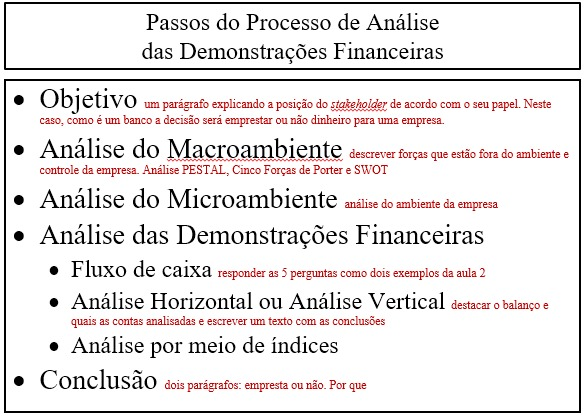
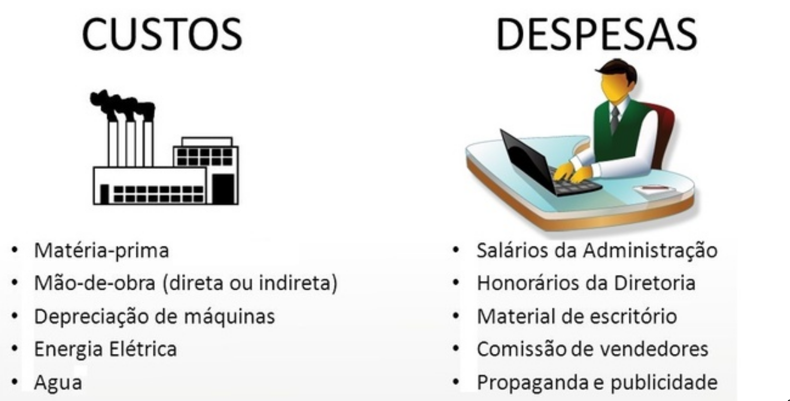

# Aula 4/Aug/2018 (8:30-12:30h)

## Geração de Caixa

O valor de uma empresa depende do **fluxo de caixa** e não do **lucro**.
Lucro: Conceito de eficiência. Quem tem lucro tem receita maior dos que os outros gastos e investimentos
Fluxo de caixa livre: Dinheiro que sobra após assumir todos os custos e despesas da empresa (dividendos).

### Fluxo de caixa (composto por 3 blocos):
1. Operacional - operações geram ou consomem o caixa (empresa saudável gera mais caixa do que consome com sua operação). Perguntas: A companhia gerou ou consumiu?
    + Geração Bruta
    + Investimentos operacionais de Giro (estoque, contas a receber e contas a pagar)
2. Investimentos:
    + Gera caixa: Vendendo ativos
    + Consome Caixa: Comprando novos investimentos
3. Financiamentos:
    + Com sócio:
        + Gerar caixa: aporte de capital
        + Consome caixa: Pagamento de dividendos
    + Com terceiros:
        + Gerar caixa: captação de empréstimo
        + Consome caixa: Pagamento do Principal da Dívida

### Capital de Giro
É o dinheiro que a empresa precisa para operar. Quando bem gerido a composição de geração de caixa tem sucesso.

Capital de Giro é composto por:
1. Controle de Estoque (quanto menos, mais capital | quanto mais, menos capital)
2. Contas a receber (quanto menos, mais capital | quanto mais, menos capital)
3. Contas a pagar (quanto menos, menos capital | quanto mais, mais capital)

DICA: Nem todos os fluxos de caixa mostram a geração bruta de caixa                           
 + NCG - Necessidade de Capital de Giro ou;
 + IOG - Investimento Operacional de Giro.

## Análise Financeira

Serve para decisões de curto prazo? Olha sempre para o período anterior ao processo decisório.

| Tables   |      Are      |  Cool |
|----------|:-------------:|------:|
| col 1 is |  left-aligned | $1600 |
| col 2 is |    centered   |   $12 |
| col 3 is | right-aligned |    $1 |

## Macroambiente

Produto substituto: Não é concorrente mas provê a mesma funcionalidade. Ex: batata vs arroz, carbs em geral.

### Força
Atributos da empresa que são positivos e aumentam a atuação da empresa. E.g: sustentabilidade, logística, ...

### Fraqueza
Fatores que limitam ou impactam sobre o negócio. E.g Preocupação com o meio ambiente.

### Oportunidades
Possibilidades de melhoria. E.g. adicionar inteligência e previsibilidade no varejo

### Ameaças
BLIBS

### Variáveis - Pão de Açúcar
* Prazo médio de recebimento vendas
    + 30 dias (cartão)

* Prazo médio de renovação de estoque
    + 10 dias (todo o estoque)

* Prazo médio de pagamento de fornecedores
    + 90 dias

### Resultado

Avaliação do resultado da empresa de acordo com o ponto de vista dos acionistas da empresa e de acordo com a estratégia da mesma.

## Trabalho de Análise de Crédito

Objetivo: Descobrir qual é o risco de crédito da empresa
1. Stakeholder 
    + Banco (Se vai emprestar dinheiro ou não) -> Esse que vamos utilizar para o trabalho
    + Fornecedor - Vender a prazo ou somente a vista
    + Cliente: comprar na planta ou não
	
Escolher temas que temos familiaridade para facilitar as análises. Analisar o balanço, demonstrativo de resultados e fluxo de caixa.
Verificar o passo a passo do trabalho a partir do slide 57 do arquivo: material big data  atualizado mngmt2016.2.crv2

### Passo a passo do trabalho
1. Objetivo: 
2. Análise do Macroambiente:
3. Análise do Microambiente: ambiente da empresa
4. Análise de Demonstrações Financeiras: 
   + Fluxo de Caixa
   + Análise Horizontal ou Análise Vertical
   + Análise por meio de índices
5. Conclusão: 1 página com a conclusão a respeito dos relatórios
   + 1º Parágrafo - Empresta ou não
   + 2º Parágrafo - Porque você empresta ou porque você não empresta

# Aula 4 (13:30-17:30h)

## Referências

Administração Financeira Teoria e Prática
Autores: Brigham Edhard.

## Objetivos da Contabilidade de Custos

* Determinar quanto cada produto contribui para o resultado da empresa;
* Determinar o preço de venda;
* Determinar o nível ótimo de ativida da empresa.

## Custos e Despesas

### Depreciação

A depreciação deve ser sempre mensal, referente ao valor de produto.

### Método da Absorção

$Absorção=CT_{P}=M_{D}+MO_{D}+C_{F}$

onde $CT_{P}$ é o custo de produção, $M_{D}$ é o material direto, $MO_{D}$ é a mão de  obra direta e $C_{F}$ é o custo de fabricação.

### Método Variável

$Variável=CT_{P}=CT_{F}+CV_{u}*Q$

Onde $CT_{F}$ é o custo fixo da empresa (e.g. folha de pagamento) e $CV_{u}$ é o custo variável dependente do volume de produção (e.g. matéria-prima) e $Q$ é a quantidade.

### Custos vs Despesas

### Despesa

Valor que não está associado a produção. Se o destino do gasto está associado a produção então é despesa, senão é custo.

### Investimento $\Longleftrightarrow$ Ativos

Aquisição de computadores, peças, etc.

### Custo semi-variável

Custo que é parte fixo e parte variável em relação a varíavel $Q$. 

### Custo semi-fixo

Quando o custo é unitário, mas o número de unidades pode mudar de acordo com a quantidade produzida (e.g número de galpões)

### Custo do Material

Valor pago pelo fornecedor:
* IPI - a recuperar
* ICMS - a recuperar
* PIS E CONFINS - a recuperar
* Frete
* Seguro 
* Armazenagem e outros gastos

O produto não pode ser bitributado, portanto a questão do a recuperar está relacionado a isso.

Impostos
* ICMS: Variável (~20%)
* PIS: Variável (~0,65%)
* CONFINS: Variável (~7,5%)
* IPI: Variável

$Valor_{ICMS}=\frac{Valor_{original}}{1-\%_{ICMS}}$

Apresenta o valor total aplicado o ICMS. Por exemplo, para uma taxa de 20% de ICMS, um produto de R$100,00 custa:

$Valor_{ICMS}=\frac{100}{1-0.2}=R\$125,00$

O PIS e CONFINS também são tributados internamente, portanto para um produto, fica:

$Valor_{ICMS}=\frac{Valor_{original}}{1-\%_{ICMS}-\%_{PIS}-\%_{CONFINS}}$

Por exemplo, o mesmo cálculo anterior com PIS de 0,65% e CONFINS de 7,5%, fica:

$Valor_{ICMS}=\frac{R\$100,00}{1-0.2-0.0065-0.075}=\frac{R\$100}{0.7185}=R\$139,18$

Ao $Valor_{ICMS}$ ainda é aplicado o IPI externamente:

$Valor_{final}=Valor_{ICMS}*(1+\%_{IPI})$

Para um IPI de 10%, o cálculo final do produto que custava R$139,18 fica:

$Valor_{final}=R\$139,18*(1+0.1)=R\$153,10$

### Métodos de avaliação de estoque

Cálculo de Imposto
* PEPS
    + O primeiro a entrar é o primeiro a sair (e.g perecíveis)
* UEPS (Não pode ser usado no Brasil)
    + Último que entra, primeiro que sai (e.g. chapas de aço)
* Custo Médio 
    + Mais usado no Brasil por ter menor % de IR

### Activity Based Costing (Custos Indiretos)

Os custos indiretos são adicionados por meio de rateio. O problema dos rateios é que eles são arbitrários caso não possam ser justificadas através da realidade da empresa.

Fazer o rateio baseado no faturamento é uma ideia ruim pois isso penaliza os departamentos e/ou lojas que performam melhor. Sendo assim, um critério adequado nesse caso é o da *utilização* da atividade.

Por exemplo, trantado-se dos custos de uma sede da empresa, faz sentido "cobrar" o rateio em cima da utilização de chamados a mesma.

É possível ratear de maneiras diferentes de acordo com a atividade relacionada. Esse tipo de custeio denomina-se Custeio Baseado em Atividades ou Custeio ABC.

### Exercícios a fazer

Exercício 2.19

*Importante para a prova 2.20*