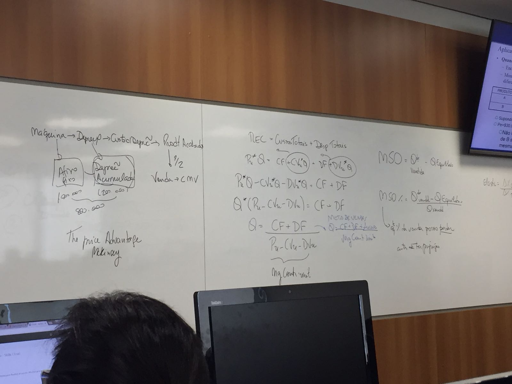

# Aula 18/Aug/2018 (12:30-17:30h)

## Exercício 2.2 (Slide 122)

$MOD+CIF=R\$37.200$

$Absorção=CT_{prod}=MD+MOD+CIF$

Onde MD = Material Direto, MOD = Mão de Obra Direta e CIF = Custo 

Passos:

1. Remover o valor da Compra sem ICMS $\rightarrow Compra_{sem ICMS}=50000*(1-\%_{ICMS})=50000*(1-0.18)=R\$41.000$
2. Calcular o Custo do Material Direto $\rightarrow Custo_{MD}=Consumo=\frac{4}{5}*41000=R\$32.800$
3. O custo total da produção fica $\rightarrow CT_{prod}=MD+MOD+CIF=32800+37200=R\$70.000$
4. O preço por unidade fica $\rightarrow Custo_{unidade}=\frac{CT_{prod}}{N_{unidades}}=\frac{70000}{20}=R\$3.500$
5. DRE Oficial
    1. $Receita_{Bruta}=15*5000=R\$75.000$
    2. $ICMS_{vendas}=0.18*75000=R\$13.500$
    3. $Receita_{Líquida}=Receita_{Bruta}-ICMS_{vendas}=75000-13500=R\$61.500$
    4. $Custo_{vendas}=15*3500=R\$52.500$
    5. $Lucro_{Bruto}=Receita_{Líquida}-Custo_{vendas}=61500-52500=R\$9.000$
6. $ICMS_{a recolher}=R\$13.500$ (Passivo, pago)
7. $ICMS_{a recuperar}=R\$9.000$ (Ativo, sobre o lucro)
8. $ICMS_{a pagar}=R\$4.500$ (É o que vai efetivamente para o documento fiscal, DARF, etc)

Erro comum de prova => O ICMS a recuperar (do que é retornado) está ligado a quantidade de vendas do mês, sujeito a um período máximo de cinco anos. Isso tem o nome de mercado de *crédito de imposto*.

Obs: Tudo que não está presente no trabalho cai.

## Custeio Variável

$CT_{total}=CT_{período}+CV_{unitário}*Quantidade$

### Margem de Contribuição

$Margem_{contribuição}=Receita_{Bruta}-Custos_{Var}-Desp_{Var}$

A margem de contribuição unitária é o percentual de retorno na venda de cada produto. 

A margem de contribuição por peso indica qual é a margem de contribuição do produto por unidade de peso. 

### Lucro Operacional

$Lucro_{operacional}=Margem_{contribuição}-Custo_{fixo}-Despesa_{fixa}$

### Diferenças DRE Gerencial vs DRE Oficial

| DRE Gerencial       |  DRE Oficial         |
|---------------------|----------------------|
| Receita Líquida     | Receita Líquida      |
| Custos Variáveis    | Custos Variáveis     |
| Despesas Variáveis  | Custos Fixos         |
|---------------------|----------------------|
|  = Mg Contrib       | = Lucro Bruto        |
| - Custo Fixo        | - Despesas Fixas     |
| - Despesa Fixa      | - Despesas Variáveis |
|---------------------|----------------------|
| = Lucro Operacional | = Lucro Operacional  |

No processo de decisão de um desconto ao cliente deve-se levar em consideração o DRE Gerencial e não o DRE Oficial, uma vez que esse leva em consideração todas as despesas, como aluguel, etc. 

## Livro Mckinsey - The price advantage

## Exercícios

### Exercício 3.29

Não, pois o sapato possui margem de  contribuição maior, no valor de R$35,00 contra R$30,00 da bolsa.

### Exercício 3.36

A margem de contribuição da lata é 0,55/lata enquanto o da garrafa é 0,90/garrafa, porém a garrafa consome dois lugares, sendo assim sua margem de contribuição por espaço é de 0,45/espaço contra 0,55/espaço da lata. Assim, vale mais a pena focar em latas.

## Fotos da Aula

