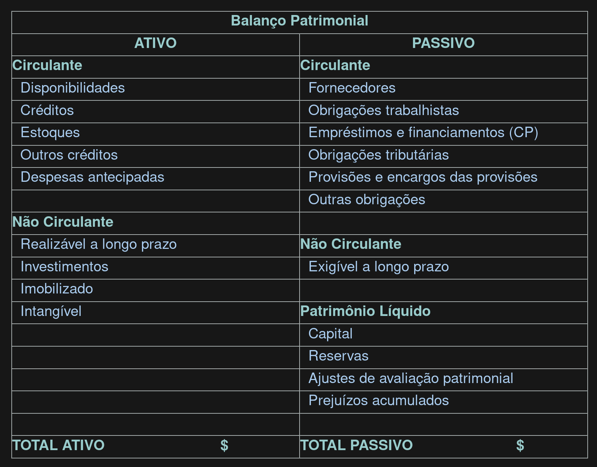

## Ativo

Todos as contas do Ativo encontram-se discriminadas no lado esquerdo do Balanço Patrimonial e são classificadas em ordem decrescente do grau de liquidez dos elementos patrimoniais que representam. Ou seja, de acordo com a rapidez com que podem ser convertidas em dinheiro (ordem de liquidar as dívidas, de pagar os compromissos). Os ítens de maior liquidez aparecem no começo do Ativo, já os de menor liquidez aparecem em último lugar. Ex.: a conta Caixa é a de maior liquidez, encontrando-se no topo. Já a conta Máquinas e Equipamentos tem uma liquidez menor, encontrando-se classificada mais abaixo, pois não possui o mesmo potencial que a conta Caixa para ser convertida em dinheiro.

### Ativo Circulante

O Ativo Circulante agrupa dinheiro e tudo o que será transformado em dinheiro rapidamente.

### Ativo Não-Circulante

## Passivo 

Todas as contas do Passivo encontram-se discriminadas no lado direito do Balanço Patrimonial e são classificadas segundo a ordem decrescente de exigibilidade. As contas são originadas de recursos de terceiros e são classificadas de acordo com o seu vencimento, isto é, aquelas contas que serão liquidadas mais rapidamente (curto prazo) aparecem no topo da coluna do Passivo, e as que serão pagas em um prazo maior (longo prazo) aparecem mais para o final.

